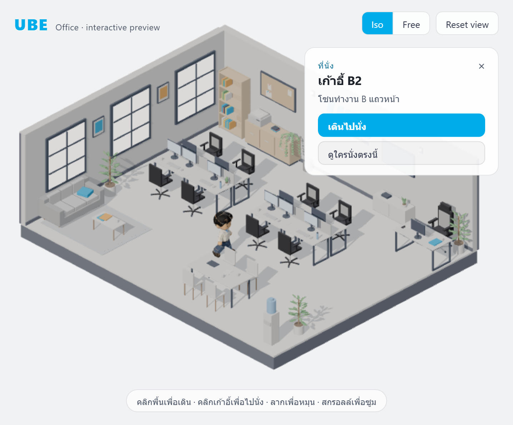
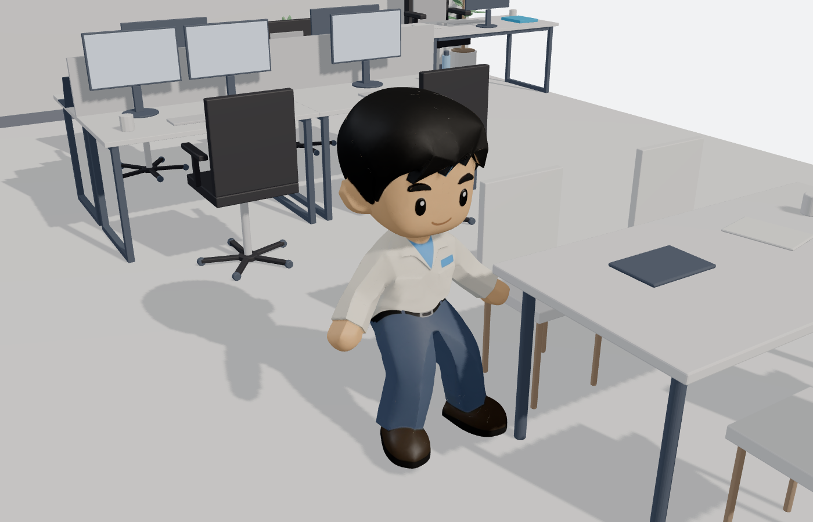
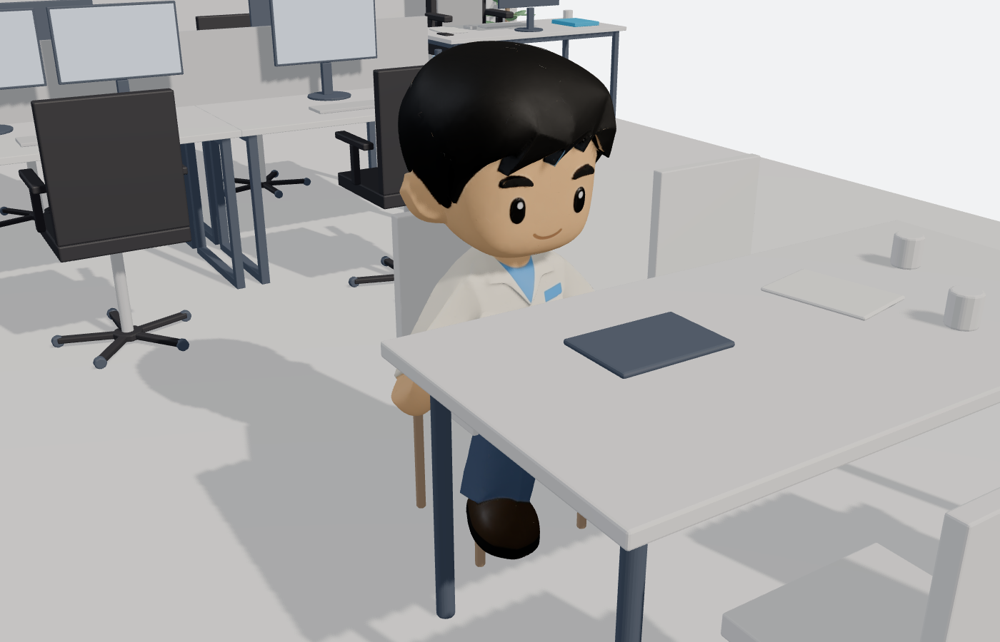
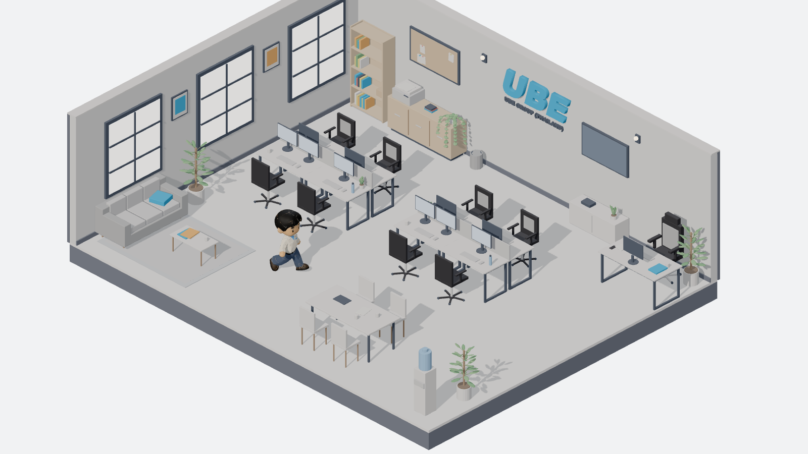
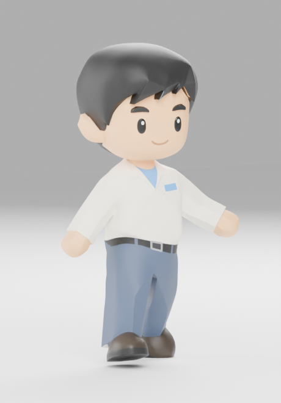
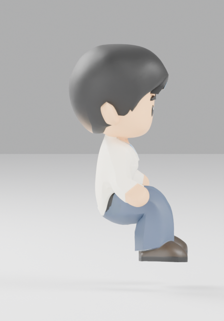

# UBE Office

An interactive isometric office in the browser. Click the floor and the chibi engineer walks
there, routing around the desks; click a chair and he walks over, turns, and sits down.

The room is modelled procedurally in Blender, the character comes from a generative 3D tool
and is rigged by script, and everything is served to three.js straight out of the export
folder — no asset copying, no manual placement.



**[▶ Live demo](https://pakornkub.github.io/my-3d-test/)** · every push to `main` rebuilds and
publishes the site to the `gh-pages` branch ([workflow](.github/workflows/deploy.yml)), and
`npm run deploy` does the same from a laptop.

---

## What you can do

| | |
| --- | --- |
| **Click the floor** | A\* path around the furniture, then walk |
| **Click any of 13 chairs** | Walk to the approach spot, turn to the seat angle, sit |
| **Click an object** | A card opens with its name and a list of suggested actions |
| **Drag / scroll** | Orbit and zoom |
| **Iso / Free** | Orthographic preset that matches the Blender render, or free perspective |

<table>
<tr>
<td width="50%"></td>
<td width="50%"></td>
</tr>
<tr>
<td align="center"><em>Walking — a real skeletal walk cycle, not a slide</em></td>
<td align="center"><em>Sitting — one clip serves all 16 seats</em></td>
</tr>
</table>

Only the chair actions do something today. Every other action button reports its id and shows
a toast, so the interaction surface is visible and filling it in is a data edit
(`src/hotspots.js`) plus one branch in `runAction()`.

## Quick start

```bash
npm install
npm run dev
```

Requires Node 20+. Nothing else to configure — `vite.config.js` points `publicDir` at
`export/`, which is exactly where the Blender pipeline writes.

### Deploying

```bash
npm run deploy      # build, then force-push dist/ to the gh-pages branch
```

Publishing is a plain branch push rather than a call to the Pages REST API, because the
Actions `GITHUB_TOKEN` on this repo is not allowed to create or update a Pages site
(`Resource not accessible by integration`). A branch push only needs `contents: write`, so
the same script works from CI and from a laptop.

**One-time setup:** *Settings → Pages → Build and deployment → Deploy from a branch →
`gh-pages` / `(root)`*. Until that is set, the branch is published but nothing serves it.

## How it is built

```
blender/iso_office_lib.py ───────────► export/ube_office.glb
                                       export/seats.json  (16 seats)
                                       export/obstacles.json  (58 boxes)
                                               │
blender/source/eng_m1_meshy.blend              │
        │  normalize_character.py              │
        │    scale to 1.38 m, origin to the    │
        │    floor, rotate to face -Z          │
        ▼                                      │
        │  rig_character.py                    │
        │    17-bone biped, skin weights,      │
        │    Idle / Walk / Sit / SitIdle       │
        ▼                                      ▼
export/characters/eng_m1.glb ────────► src/*.js  →  browser
```

The office was never authored by hand: `iso_office_lib.py` lays it out from
[`blender/layout_plan.svg`](blender/layout_plan.svg) and, crucially, exports the two data
files the runtime needs — where every seat is, which way it faces, where to stand before
sitting, and the bounding box of every solid object. The web app does no manual placement at
all; it reads those files.



### The character had no skeleton

The generated model could stand, and nothing else. `rig_character.py` builds a 17-bone
armature sized to the 1.38 m chibi, binds it (validated, with a rigid per-region fallback if
the automatic weights misbehave), authors the four clips, and writes verification renders
before anything reaches the browser.

<table>
<tr>
<td width="50%"></td>
<td width="50%"></td>
</tr>
<tr>
<td align="center"><em><code>Walk</code>, frame 4</em></td>
<td align="center"><em><code>Sit</code>, final frame</em></td>
</tr>
</table>

**One sit clip, sixteen seats.** The clip ends with the hips at a documented height above the
origin, and the runtime places the root at `seat.y − sit_hip_y`. That works because a 1.38 m
chibi's legs are shorter than every chair in the room — the feet dangle, so the ±5 cm
difference between the sofa and the manager's chair is invisible.

## Stack

`three@0.186` and `vite@8` — nothing else. `OrbitControls`, `GLTFLoader` and `SkeletonUtils`
ship inside three; the pathfinder is about 80 lines rather than a dependency.

```
src/
  main.js         wiring, picking, actions
  scene.js        renderer, lights, the two cameras
  characters.js   asset loading, spawning, clip playback
  character.js    walk / turn / sit state machine
  nav.js          occupancy grid, A*, path smoothing, approach repair
  hotspots.js     object name -> label, category, suggested actions
  ui.js           HUD, object card, toast
```

`window.__ube` exposes the scene for poking at from the console:
`__ube.controller.walkTo(5, -2)`, `__ube.step(60)`, `__ube.screenOf('ManagerChair')`.

## Things worth knowing

- **Four of the sixteen `approach` points in `seats.json` are inside furniture.** The
  generator used `seat − forward × 0.75` even where `−forward` points into a wall, so all
  three sofa cushions and one meeting chair are unreachable as written.
  `NavGrid.repairApproaches()` re-derives them at load and logs what it changed.
- **glTF node names are not Blender node names.** `GLTFLoader` strips dots, so `Picture.001`
  arrives as `Picture001`. `src/hotspots.js` uses the loaded spelling.
- **11 MB of assets** on first load. Most of it is three 2048² textures on the character where
  the scene only ever samples base colour.
- **One character so far.** The roster has five; the app spawns from the manifest, so the rest
  appear as soon as they are generated and run through the two Blender scripts.

Pipeline details, the seat-height contract and how to add the rest of the cast are in
[CHARACTERS.md](CHARACTERS.md).
