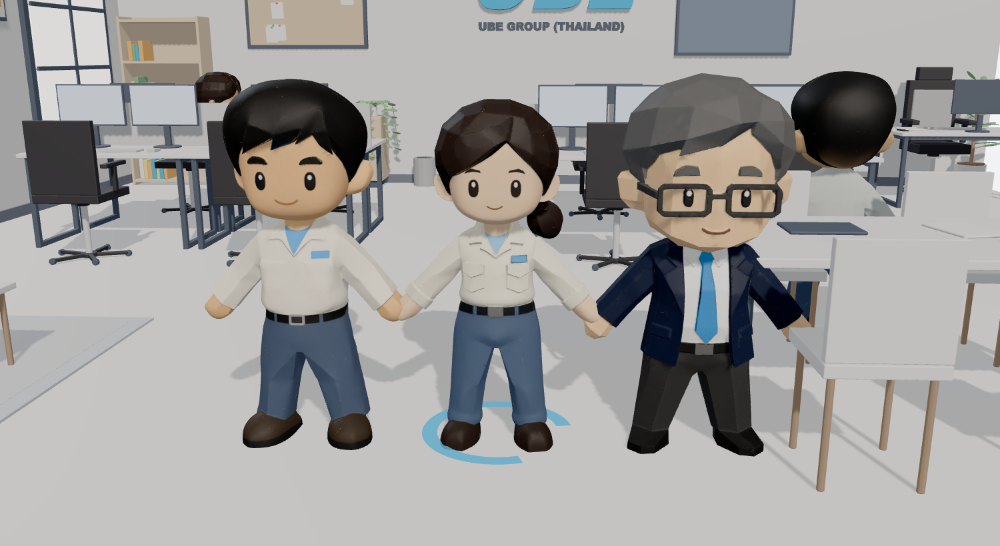
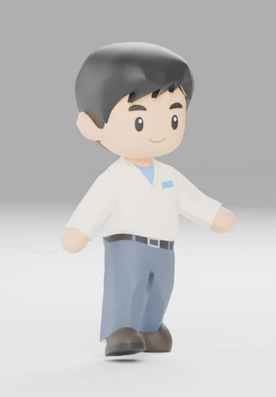
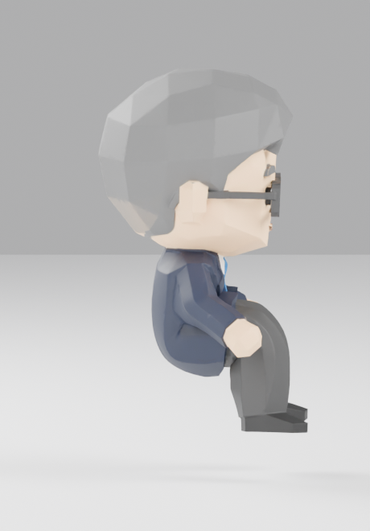

# UBE Office

An interactive isometric office in the browser. Pick someone from the crew, click the floor
and they walk there routing around the desks, or click a chair and they walk over, turn, and
sit down.

The room is modelled procedurally in Blender, the characters come from a generative 3D tool
and are rigged by script, and everything is served to three.js straight out of the export
folder — no asset copying, no manual placement.


**[▶ Live demo](https://pakornkub.github.io/my-3d-test/)** · every push to `main` rebuilds and
publishes the site to the `gh-pages` branch ([workflow](.github/workflows/deploy.yml)), and
`npm run deploy` does the same from a laptop.

---

## What you can do

| | |
| --- | --- |
| **Pick someone** | Click them, or press `1`–`6`. A ring marks who has the floor; `Esc` clears it |
| **Click the floor** | A\* path around the furniture, then walk. With nobody picked, the nearest free person goes |
| **Click any of 13 chairs** | Walk to the approach spot, turn to the seat angle, sit. A chair someone already claimed is refused |
| **Click an object** | A card opens with its name and a list of suggested actions |
| **Drag / scroll** | Orbit and zoom |
| **Iso / Free** | Orthographic preset that matches the Blender render, or free perspective |
| **ทีม (top right)** | Opens the team panel: chat with the manager, ticket board, docs, project checklist, TV. **เล่นตัวอย่าง** runs a scripted demo of the whole agent flow |



Three models exist so far — a male engineer, a female engineer and the manager, each
generated separately and put through the same pipeline. The roster lists six; the three
without a model yet borrow one and are tinted, and stop being placeholders the moment a real
model lands in `blender/source/`.

<table>
<tr>
<td width="50%"></td>
<td width="50%"></td>
</tr>
<tr>
<td align="center"><em>Walking — a real skeletal walk cycle, not a slide</em></td>
<td align="center"><em>Sitting — one clip serves all 16 seats</em></td>
</tr>
</table>

Chair actions sit people down; the team actions (`meet`, `gather`, `report`, `present`,
`notices`, `browse`) open the agent office described below. The rest still report their id
and show a toast, so filling one in is a data edit (`src/hotspots.js`) plus one branch in
`runAction()`.

## The agent team (phase 0: the stage)

The six people are the cast of a Claude agent team that follows the
[mattpocock-skills](https://www.aihero.dev/skills) main flow: the **manager** grills you at
the meeting table, writes the spec, breaks it into tracer-bullet tickets on the notice board;
**implementers** (A, B, C) grab tickets from the frontier and sit at their desks; the
**reviewer** (D) runs the two-axis code review; **QA** (E) opens the real thing at the TV and
ticks acceptance criteria; the manager reports back on the TV.

Nothing in the browser talks to Claude. The scene only consumes an **event stream**
(`src/agents/events.js` is the contract) and a **Director** turns each event into walking,
sitting and speech bubbles. Today the events come from `src/agents/mock.js`, a scripted
driver that plays the whole flow including a tool approval, a failed review, a stalled ticket
and an escalation; press **ทีม** then **เล่นตัวอย่าง**, or type an idea into the chat.
Untick *ตอบให้เอง* to answer the manager's questions yourself. The same panel and Director
will sit on a WebSocket to a local Node process running the Claude Agent SDK in phase 1;
the GitHub Pages build stays on the mock.

`npm test` runs the Director against a fake crew and the event validator (`tests/`).

## Quick start

```bash
npm install
npm run dev
```

Requires Node 20+. Nothing else to configure — `vite.config.js` points `publicDir` at
`export/`, which is exactly where the Blender pipeline writes.

### Deploying

```bash
npm run deploy      # build, then force-push dist/ to the gh-pages branch
```

Publishing is a plain branch push rather than a call to the Pages REST API, because the
Actions `GITHUB_TOKEN` on this repo is not allowed to create or update a Pages site
(`Resource not accessible by integration`). A branch push only needs `contents: write`, so
the same script works from CI and from a laptop.

**One-time setup:** *Settings → Pages → Build and deployment → Deploy from a branch →
`gh-pages` / `(root)`*. Until that is set, the branch is published but nothing serves it.

## How it is built

```
blender/iso_office_lib.py ───────────► export/ube_office.glb
                                       export/seats.json  (16 seats)
                                       export/obstacles.json  (58 boxes)
                                               │
blender/source/*_meshy.blend                   │
        │  normalize_character.py              │
        │    scale to the roster height,       │
        │    origin to the floor, face -Z      │
        ▼                                      │
        │  rig_character.py                    │
        │    17-bone biped scaled to fit,      │
        │    skin weights, four clips,         │
        │    textures trimmed for the web      │
        ▼                                      ▼
export/characters/*.glb ─────────────► src/*.js  →  browser
```

The office was never authored by hand: `iso_office_lib.py` lays it out from
[`blender/layout_plan.svg`](blender/layout_plan.svg) and, crucially, exports the two data
files the runtime needs — where every seat is, which way it faces, where to stand before
sitting, and the bounding box of every solid object. The web app does no manual placement at
all; it reads those files.


### The character had no skeleton

A generated model can stand, and nothing else. `rig_character.py` builds a 17-bone armature,
scales it to that character's height, binds it (validated, with a rigid per-region fallback
if the automatic weights misbehave), authors the four clips, and writes verification renders
before anything reaches the browser.

<table>
<tr>
<td width="50%"></td>
<td width="50%"></td>
</tr>
<tr>
<td align="center"><em><code>Walk</code>, frame 4</em></td>
<td align="center"><em><code>Sit</code>, final frame — the manager on a 0.55 m chair</em></td>
</tr>
</table>

**One sit clip, sixteen seats, any height.** The clip ends with the hips at a height recorded
per character in `characters.json`, and the runtime places the root at `seat.y − sit_hip_y`.
That works because a chibi's legs are shorter than every chair in the room — the feet dangle,
so the few centimetres between the sofa and the manager's chair never show.

## Stack

`three@0.186` and `vite@8` — nothing else. `OrbitControls`, `GLTFLoader` and `SkeletonUtils`
ship inside three; the pathfinder is about 80 lines rather than a dependency.

```
src/
  main.js         wiring, picking, actions, the crew roster
  scene.js        renderer, lights, the two cameras
  characters.js   asset loading, spawning, clip playback
  character.js    walk / turn / sit state machine, one per person
  crew.js         selection, seat claims, keeping bodies apart
  nav.js          occupancy grid, A*, path smoothing, approach repair
  hotspots.js     object name -> label, category, suggested actions
  ui.js           HUD, object card, toast, roster
  agents/
    team.js       roles, home desks, meeting seats (data)
    events.js     the event contract + validate() + frontier()
    director.js   event -> who walks where, bubbles, panel (no three.js; unit-tested)
    bubbles.js    speech bubbles via CSS2DRenderer
    panel.js      team dock: chat, board, docs, project, TV
    mock.js       scripted driver that emits the same events the server will
```

`window.__ube` exposes the scene for poking at from the console:
`__ube.crew.sendTo(5, -2)`, `__ube.step(60)`, `__ube.screenOf('ManagerChair')`.

## Things worth knowing

- **Four of the sixteen `approach` points in `seats.json` are inside furniture.** The
  generator used `seat − forward × 0.75` even where `−forward` points into a wall, so all
  three sofa cushions and one meeting chair are unreachable as written.
  `NavGrid.repairApproaches()` re-derives them at load and logs what it changed.
- **glTF node names are not Blender node names.** `GLTFLoader` strips dots, so `Picture.001`
  arrives as `Picture001`. `src/hotspots.js` uses the loaded spelling.
- **Textures are trimmed at export.** The office has none at all, so `rig_character.py` drops
  the normal and roughness maps Meshy ships and halves the base colour: 5.6 MB -> 2.2 MB per
  character, with no change to geometry or colour. What is left is almost all mesh.
- **Three characters so far** out of a roster of six. The app spawns from the manifest, so
  the rest appear as soon as they are generated and run through the two Blender scripts.
- **Bodies do not path around each other.** The A* grid is static; a separation pass pushes
  overlapping people apart after they move, which is enough at six bodies in one room.

Pipeline details, the seat-height contract and how to add the rest of the cast are in
[CHARACTERS.md](CHARACTERS.md).
